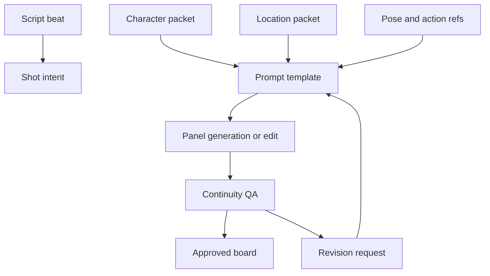

# Verifying Claims About an AI Storyboard System

## Executive summary

The strongest evidence supports a **hybrid conclusion**: a modern AI storyboard system is commercially plausible and potentially valuable, but only if it is built as a **two-layer stack** rather than treated as a single model. The first layer is a production workspace that handles board structure, review, timing, editorial interchange, and downstream handoff. The second layer is an image engine that assists with panel generation, edits, and style or character exploration. Official product documentation strongly supports this separation. Toon Boom Storyboard Pro is explicitly positioned as an end-to-end preproduction tool for thumbnails, boards, animatics, and production handoff, while OpenAI, Google, and Midjourney position their systems primarily as image generation and editing tools rather than storyboard management systems. citeturn33view1turn1view2turn7view0turn12view0

Several commonly repeated claims are **verifiable only in part**. It is verifiable that OpenAI’s latest API image model is `gpt-image-2`, that Google’s current “Nano Banana Pro” branding maps to `gemini-3-pro-image-preview`, and that Midjourney’s current product surface spans V7 and V8.1. It is **not** verifiable from primary vendor materials that these systems publish full architectures, layer counts, or complete training-set disclosures. OpenAI provides only a high-level description of its native image-generation approach through GPT-4o, Google publishes capability and pricing details but not a training card for Gemini 3 Pro Image, and Midjourney’s official docs do not disclose training data or architecture. citeturn1view2turn7view0turn26view0turn16view0turn30view0

For **character consistency**, the evidence is better than for architecture. OpenAI and Google both publish official guidance that effectively endorses consistency-oriented workflows: preserve lists, iterative edit chains, reference-image reuse, character-sheet creation, and multi-image conditioning. Midjourney also supports consistency through Omni Reference, Style References, and Moodboards, but its own docs warn about detail slippage and feature incompatibilities. The result is that AI can already be useful for **ideation, rough boards, pitch boards, and exploratory animatics**, but still needs structured QA before it is trusted for continuity-critical production boards. citeturn27view0turn27view2turn8view4turn9search4turn12view0turn12view2turn15view0

Economically, the evidence points to a clear pattern: **generation cost is cheap relative to labor**, while continuity supervision, directorial review, and handoff remain the dominant costs. The Animation Guild reports an average of **10 to 20 minutes per television storyboard panel** before revision time, timing, or dialogue-track work. By contrast, official per-image prices for current models are measured in cents or fractions of a dollar. This means ROI is usually driven less by inference fees and more by whether the system reduces revision cycles, roughing time, asset-search time, and reshoot risk. citeturn32search19turn1view4turn26view0turn15view2turn36search4

The scope and evaluation dimensions in this report follow the storyboard-system brief supplied by the user. fileciteturn0file0

## Model evidence and claim verification

The most defensible way to verify model claims is to separate **what vendors officially publish** from **what users often infer**.

### What is currently verifiable

| Model | Official product identity | Published architecture detail | Verified I/O and size details | Pricing and latency evidence | Licensing and data-use posture | Known limitations |
|---|---|---|---|---|---|---|
| **OpenAI GPT Image 2** | OpenAI’s latest image model in the API docs and image-generation guide. citeturn1view2turn3search9 | Full architecture not publicly disclosed. OpenAI’s official GPT-4o image-generation release describes a native multimodal approach using a large autoregressive transformer over compressed representations with a powerful decoder, but that is not a full GPT Image 2 architecture card. citeturn30view0 | Text input, image input/output; available through Image API and Responses API; outputs PNG, JPEG, or WebP; up to 16 input images for edits; flexible sizes up to 3840 px max edge, including 4K landscape and portrait. citeturn1view2turn3search14turn3search16turn2view5 | Official API pricing shows `gpt-image-2` low, medium, and high image-generation costs, with square low as low as $0.006 and medium at $0.053 per 1024 square image; OpenAI positions low quality as suitable for latency-sensitive workflows, but does not publish an official seconds-per-image SLA. citeturn2view5turn1view4turn1view1 | OpenAI states business/API data is not used for training by default; customers retain rights to input and own output to the extent permitted by law. citeturn24view0turn24view1turn22view3 | No transparent background support for `gpt-image-2`; reference-image edits increase token cost; organization verification may be required. citeturn2view6turn2view1turn1view2 |
| **Google Gemini 3 Pro Image Preview** | Officially documented as `gemini-3-pro-image-preview`, branded in public-facing materials as Nano Banana Pro. citeturn7view0turn7view7 | No full architecture disclosure in current official materials. Google documents “thinking,” real-world grounding via Search, and reasoning-enhanced composition, but not a technical training card. citeturn7view0turn8view7 | Up to 14 mixed reference images; official docs distinguish character and object references; 1K, 2K, and 4K image generation; text and image outputs. citeturn8view7turn26view0 | Official pricing is $0.134 per 1K/2K image and $0.24 per 4K image on standard pricing, with cheaper batch/flex tiers; Google positions Nano Banana 2 as the high-efficiency counterpart, implying Pro is quality-first rather than speed-first. citeturn26view0turn7view0 | Google says it will not claim ownership over generated content; Cloud terms state generated output is customer data; paid tier is marked “Used to improve our products: No,” while unpaid services may be used to improve Google products and may be human reviewed. citeturn22view1turn22view2turn26view0 | Official blog says Google is still improving long-form text rendering, more reliable character consistency, and factual fine details. citeturn7view4 |
| **Google Gemini 2.5 Flash Image / Gemini 3.1 Flash Image** | Official docs retain `gemini-2.5-flash-image`; newer docs frame Nano Banana 2 as `gemini-3.1-flash-image-preview`. citeturn26view0turn7view0 | No full architecture disclosure. Google emphasizes speed, contextual understanding, multi-image fusion, and world knowledge. citeturn7view4turn7view0 | Official 2.5 Flash Image pricing page shows up to 1024 square output for the cited per-image rate; 3.1 Flash Image docs support up to 14 references and additional aspect ratios. citeturn26view0turn8view7 | 2.5 Flash Image is $0.039 per image standard at 1024 square, with lower batch/flex rates and higher priority rates. Google positions 3.1 Flash Image as optimized for speed and high-volume use. citeturn26view0turn7view0 | Same Google ownership and paid-vs-unpaid data-use caveats apply. citeturn22view1turn22view2turn26view0 | Preview status means rate limits and behavior may change before stabilization. citeturn26view0 |
| **Midjourney V7 and V8.1** | Midjourney’s docs show **V7** as the current default, while **V8.1** was released on April 30, 2026 as its fastest model so far. citeturn16view0 | No official architecture disclosure or training-data card. citeturn15view3 | Web and Discord workflows; V7 introduced Omni Reference and Draft Mode; V8.1 adds native 2K HD generation. Omni Reference accepts one reference image and is V7-only. citeturn12view0turn16view0 | V8.1 standard jobs render about 4 to 5 times faster than earlier versions; V7 Draft Mode is 10x faster and half GPU cost; plans range from $10 to $120 per month with GPU-time allocation. citeturn16view0turn15view1turn15view2 | Midjourney says users own images and videos they create, but the service is provided “as is” and the company forbids automated tools, reverse engineering, and using outputs to violate others’ rights. citeturn13search11turn15view3 | Omni Reference is incompatible with several edit modes and not supported in Fast or Draft Mode; V8.1 still routes some editing functions through V6.1-era tooling. Midjourney is also under copyright litigation from Disney, Universal, and Warner Bros., which raises procurement risk even though the allegations are not the same as an adjudicated finding. citeturn12view0turn16view0turn11search2turn11news37 |

### What this means for claim verification

A few conclusions are especially important for a storyboard system procurement or architecture review.

First, **exact architectural claims are usually not verifiable from primary materials**. You can verify capabilities, pricing, input limits, ownership terms, and some safety or data-handling conditions, but not detailed network topology or training corpus composition for current proprietary image models. A vendor pitch that claims exact internal architecture for GPT Image 2, Gemini 3 Pro Image, or Midjourney V7 should therefore be treated as **marketing or inference unless tied to a primary disclosure**. citeturn30view0turn7view0turn15view3

Second, **leaderboard claims need source discipline**. Arena’s public text-to-image leaderboard on May 12, 2026 showed `gpt-image-2 (medium)` at **1393±7**, `gemini-3.1-flash-image-preview` at **1268±5**, and `gemini-3-pro-image-preview-2k` at **1242±4**. Artificial Analysis also ranks GPT Image 2 at the top of its own image arena metrics, but its scoring scale and methodology differ. If a storyboard-system brief cites a different gap, especially one involving Midjourney, that claim may be **stale, benchmark-specific, or source-mismatched rather than flatly false**. citeturn18view0turn18view2

Third, **Midjourney has a practical integration constraint that matters more than many quality debates**. The official Terms of Service prohibit automated tools interacting with the service, and the current documentation set does not expose a public developer API. That makes Midjourney excellent for art direction, tone exploration, and concept look development, but much harder to use as the backbone of a fully automated storyboard production system. citeturn15view3

## Reference workflow and production handoffs

The strongest reference workflow is not “prompt in, storyboard out.” It is a staged preproduction pipeline in which the storyboard system supports visual thinking, review, timing, and editorial interchange.

The DGA’s own director-development material reinforces the core production logic: storyboards are most useful **early**, should be **shared widely**, and provide **specificity and clarity** about what the director intends to show and what each frame composition requires. The same DGA discussion also highlights adjacent artifacts such as shot guides, script notes, floor plans, trackers, and checklists, which means any serious system should support more than image generation alone. citeturn33view0

Toon Boom’s product messaging aligns with that real-world workflow. Storyboard Pro is explicitly marketed as a tool for **thumbnailing**, **refining visual storytelling**, **pitching boards**, and **timing camera moves in an animatic** throughout preproduction. Its official docs then expose the handoff surface: PDF export for review packages, movie export for boards and animatics, EDL/AAF/XML export for non-linear editing, Harmony-scene export for downstream animation, and layout-image export for scene-positioning work. citeturn33view1turn34search1turn34search5turn34search8turn34search9turn34search12turn34search14

Boords validates the same pattern from a cloud-collaboration angle. Its official export surface includes PDF, MP4 animatics, images, and shot lists; its product and pricing pages emphasize versioning, guest comments, real-time collaboration, and sign-off workflows. citeturn36search0turn36search2turn36search4turn36search5turn36search6

```mermaid
flowchart LR
    A[Script lock] --> B[Scene breakdown and shot intents]
    B --> C[Lookbook and character packet]
    C --> D[Thumbnail pass]
    D --> E[Writer and director review]
    E --> F[Revised storyboard panels]
    F --> G[Timed animatic with temp audio]
    G --> H[Editorial handoff]
    H --> I[Layout and animation handoff]
    I --> J[Revision loop and sign-off]
```

This staged workflow reflects DGA guidance on early-sharing and frame specificity, plus the officially documented handoff surfaces in Storyboard Pro and Boords. citeturn33view0turn34search8turn34search9turn36search2

### Recommended handoff pattern

| Handoff goal | Recommended artifact | Best-supported tools in this source set | Why it matters |
|---|---|---|---|
| Early creative review | PDF storyboard packet | Storyboard Pro PDF export; Boords PDF Builder. citeturn34search1turn34search3turn36search2 | Best for writer, director, agency, client, and production review. |
| Pacing and timing approval | Movie or MP4 animatic with temp audio | Storyboard Pro movie export; Boords MP4 animatics. citeturn34search5turn34search11turn36search2 | Lets stakeholders approve rhythm before editorial or shoot commitments. |
| Editorial interchange | EDL, AAF, XML | Storyboard Pro conformation and sequence export. citeturn34search8turn34search14 | Critical if animatics or boards must land in NLE timelines. |
| Animation downstream | Harmony scenes, layout images | Storyboard Pro Harmony export and layout export. citeturn34search9turn34search12 | Useful in animation pipelines where boards become structured scene packages. |
| Remote review and version history | Shared links, comments, version control | Boords real-time collaboration, guest comments, version control, activity trail. citeturn36search0turn36search6 | Shortens review cycles and preserves approval history. |

### Best-practice implications for a new storyboard system

A workable best-practice blueprint is:

- keep the **script and shot intent** as a first-class object
- use AI panels at the **thumbnail, alternate, and revision** stages, not as the sole system of record
- maintain a **timed animatic** before production commitment
- separate **creative review formats** from **editorial interchange formats**
- preserve a **versioned audit trail** of changes and sign-offs

In other words, the system should look more like a **preproduction control plane** with image-generation tools attached than like a prompt-only image sandbox. That is where the official tool documentation and director workflow evidence converge. citeturn33view0turn33view1turn34search8turn36search4turn36search6

## Character consistency and continuity QA

This is the area where vendor claims are closest to production reality, but also where uncritical optimism causes the most trouble.

OpenAI’s official prompting guidance is unusually explicit: for edits, users should state **what to change vs preserve**, use **“change only X”** and **“keep everything else the same,”** and repeat the preserve list across iterations to reduce drift. The same guide gives examples that lock face, skin tone, body shape, pose, identity, background, and camera angle while changing only wardrobe or a localized scene element. citeturn27view0turn27view2

Google’s official materials make the same continuity logic visible in a different form. The Gemini image docs advise reusing previous outputs in subsequent prompts to maintain 360-degree character views, and to include a pose reference for complex poses. Google’s codelab for “Generating Consistent Imagery” teaches a pipeline based on archive images, character-sheet creation, spatial understanding, and an asset graph. Current Gemini image docs also support up to 14 references in a single workflow, with explicit slots for character-consistency inputs. citeturn9search4turn8view4turn8view7

Midjourney’s consistency tools are real but narrower. Character Reference and its V7 successor Omni Reference let users recreate a character from a reference image, while Style References and Moodboards help stabilize the overall aesthetic. But Midjourney’s own docs warn that intricate details like freckles or clothing logos may not match perfectly, and Omni Reference is limited to one source image and several incompatible edit modes. citeturn12view0turn12view1turn12view2turn15view0

### A production-safe continuity method

The most robust method supported by the evidence is a **canonical packet + controlled edits** workflow:

1. Build a **character packet** first: front, profile, key expression sheet, wardrobe anchors, hero props, color notes.
2. Require a **role hierarchy** for references: canonical character first, then location, then costume, then pose.
3. Prefer **editing from approved panels** over fresh generations when continuity matters.
4. Keep a **locked invariant list** in prompts or metadata: face shape, hair, costume SKU, role props, camera language, palette, aspect ratio.
5. Maintain a **continuity ledger** per scene: emotional state, costume state, prop state, damage state, and staging side.

This is not merely prompt craft. It is production metadata. OpenAI and Google’s official materials strongly support this direction, even if they do not formalize it in film-production terminology. citeturn27view0turn27view2turn8view4turn9search4

This entity relationship is the safest interpretation of the official consistency guidance: references, prompts, and approved panels should reinforce each other rather than compete. citeturn27view0turn9search4turn8view7

### Recommended evaluation metrics and thresholds

The table below is a **proposed operational QA framework**, not an industry standard. It is derived from the verified capabilities and limitations above and is designed for keeping an AI storyboard system honest in production.

| Metric | What to measure | Recommended threshold | Why it matters |
|---|---|---|---|
| **Identity pass rate** | Percentage of panels where a reviewer agrees the recurring character is unmistakably the same person | **95%+** on hero-character panels | Below this, director and editorial time is consumed by avoidable redraws |
| **Wardrobe and prop continuity** | Percentage of panels with correct outfit, hero prop, and state continuity | **98%+** for locked costume and prop scenes | Mid-sequence costume slips create expensive downstream confusion |
| **Shot-intent fidelity** | Match between prompted shot type, camera angle, staging side, and final panel | **95%+** on approved prompt templates | A storyboard system that misses shot language is not production-safe |
| **Text and annotation accuracy** | Legibility and correctness of in-panel labels, signs, or UI text | **99%** for production-facing labels; **100%** after human proofing | OpenAI and Google are strong here, but neither claims perfection in all cases citeturn1view1turn7view4 |
| **Revision churn** | Share of approved panels reopened after director sign-off | **Under 10%** | High churn usually means weak prompt locking or inadequate review gates |
| **Editorial handoff integrity** | Success rate of PDF, movie, XML, or AAF exports opening cleanly downstream | **100%** | Broken handoffs erase any gain from fast generation |

### Recommended automated and human checks

For automation, the system should at minimum support:

- **metadata linting** for aspect ratio, scene ID, panel order, character ID, and prompt-template version
- **reference-set validation** so every hero character panel points to a current approved packet
- **text and annotation checks** for required labels, subtitles, and board notes
- **panel-diff alerts** on identity-critical attributes when a previously approved character drifts visually

For human review, the minimum safe protocol is:

- **board lead review** for visual continuity
- **director review** for shot intent and storytelling
- **editorial or animatic review** for timing and transition logic
- **pre-handoff review** of export packages, not just images

The crucial point is that **continuity cannot be measured only by image similarity**. It also includes story state, performance intent, staging, and handoff integrity.

## Tool and vendor landscape

The market breaks into two categories that are often incorrectly merged: **storyboard workspaces** and **image engines used to generate panels**. A rigorous vendor comparison should keep them separate.

### Production workspaces with directly verified documentation

| Vendor and tool | Import and export surface | AI-assisted panel support | Versioning and collaboration | Pricing and licensing | Integrations and handoffs | Best fit |
|---|---|---|---|---|---|---|
| **Toon Boom Storyboard Pro 25** | Verified exports include PDF, movie files, EDL/AAF/XML sequences, Harmony scenes, layout images, and current-frame bitmap export. citeturn34search1turn34search5turn34search8turn34search9turn34search12turn34search14 | Toon Boom’s Ember add-on is explicitly framed as assistive, not a replacement for artists; Storyboard Pro also supports quick thumbnailing and scanned paper thumbnails. citeturn33view1 | The source set verifies compact project-file options for remote collaboration, but not a cloud-native comment/version stack comparable to Boords. citeturn33view1 | Toon Boom markets “flexible licensing options” and direct purchase/trial flows, but the exact price was not exposed in the retrieved source set. citeturn33view1 | Strongest documented downstream integration in this source set. Editorial interchange and Harmony handoff are first-class. citeturn34search8turn34search9 | Studio animation pipelines and any team that needs structured editorial and animation handoff |
| **Boords** | Verified exports include PDF, MP4 animatics, images, and shot lists. citeturn36search2turn36search5 | Official pricing page includes AI images. citeturn36search0 | Strong cloud collaboration surface: no-signup client reviews, guest commenting, real-time collaboration, version control, and activity trail. citeturn36search0turn36search4turn36search6 | Official pricing page lists Free, Pro $75/month, Team $125/month, Agency $250/month, with collaboration and export limits varying by plan. citeturn36search0 | Good review and sign-off tooling, but the retrieved source set does not show AAF/XML or animation-scene exports. citeturn36search0turn36search2 | Agencies, distributed teams, client-facing video preproduction, quick animatic approval |

### Image engines commonly proposed as storyboard-panel generators

| Vendor and model | Strengths for storyboarding | Weaknesses for storyboarding | Commercial and operational notes |
|---|---|---|---|
| **OpenAI GPT Image 2** | Strong edit workflows, multi-image inputs, flexible resolutions, strong text rendering, and explicit preserve-only prompting patterns. citeturn1view1turn1view2turn27view0 | No native storyboard object model, no editorial interchange, and no public claim of formal continuity metrics. citeturn1view2 | Best used as a panel engine inside a separate workspace. Business/API outputs are customer-owned and business data is not used for training by default. citeturn24view0turn24view1 |
| **Google Gemini 3 Pro Image / 3.1 Flash Image** | Excellent multi-reference and continuity-oriented feature surface, including up to 14 references and search-grounded generation. citeturn8view7turn7view0 | Still preview-grade in parts of the product surface, with official acknowledgement that consistency and factual detail still need improvement. citeturn7view4turn26view0 | Especially strong if provenance, web grounding, and multi-reference conditioning matter. Paid tier avoids product-improvement use. citeturn22view1turn22view2turn26view0 |
| **Midjourney V7 / V8.1** | Strong style exploration via Moodboards, Style References, Omni Reference, Draft Mode, and very fast ideation. citeturn12view0turn12view2turn15view0turn15view1turn16view0 | Weakest structured production integration in this evidence set. Omni Reference is constrained, some edit functions still depend on V6.1-era workflows, and direct automation is contractually restricted. citeturn12view0turn16view0turn15view3 | Useful as an art-direction sidecar, risky as the engine of an automated storyboard pipeline. |

### Practical vendor conclusion

If the target outcome is a **production-ready storyboard system**, the most defensible architecture is:

- **Storyboard Pro** for studio animation pipelines that need XML/AAF/Harmony handoff
- **Boords** for cloud-first review, quick animatics, client sign-off, and lighter-weight teams
- **OpenAI or Google image models** as panel-generation engines inside either workflow
- **Midjourney** mainly as a concept and style-development adjunct, not the workflow backbone

That split follows the strongest official evidence available today. citeturn33view1turn36search0turn1view2turn8view7turn15view3

## Production economics and ROI

The official price sheets make one thing very clear: **AI image generation is cheap; continuity-safe preproduction is not**.

The Animation Guild reports that a script-based television storyboard panel averages **10 to 20 minutes per panel**, excluding revision time and excluding additional timing or dialogue-track work that digital workflows often require. That means labor dominates the economics even before downstream editorial, director review, or revision cycles are counted. citeturn32search19

Vendor pricing, by contrast, is small on a per-panel basis. Official sources support the following reference points:

- **OpenAI GPT Image 2**: about **$0.006** per low-quality 1024 square image and **$0.053** per medium-quality 1024 square image. citeturn2view5turn1view4
- **Google Gemini 2.5 Flash Image**: **$0.039** per image at the cited 1024 square output tier. citeturn26view0
- **Google Gemini 3 Pro Image**: about **$0.134** per 1K/2K image and **$0.24** per 4K image. citeturn26view0
- **Midjourney**: sold as subscription + GPU-time rather than a clean per-image production API; plans run from **$10** to **$120** monthly. citeturn15view2

### Modeled cost scenarios

The table below assumes **four generated candidates per approved panel**. That is a realistic planning ratio for thumbnailing and prompt iteration. These figures include only output-generation cost, not prompt-token cost, workspace seats, or human review.

| Scenario | Panels | Manual baseline from guild timing | GPT Image 2 low | GPT Image 2 medium | Gemini 2.5 Flash Image | Gemini 3 Pro Image 1K/2K |
|---|---:|---:|---:|---:|---:|---:|
| Pitch board | 60 | 10 to 20 artist-hours citeturn32search19 | **$1.44** citeturn2view5 | **$12.72** citeturn2view5 | **$9.36** citeturn26view0 | **$32.16** citeturn26view0 |
| Episode sequence board | 300 | 50 to 100 artist-hours citeturn32search19 | **$7.20** citeturn2view5 | **$63.60** citeturn2view5 | **$46.80** citeturn26view0 | **$160.80** citeturn26view0 |
| Large feature block | 800 | 133 to 267 artist-hours citeturn32search19 | **$19.20** citeturn2view5 | **$169.60** citeturn2view5 | **$124.80** citeturn26view0 | **$428.80** citeturn26view0 |

The practical takeaway is that **even expensive image-model usage is usually cheaper than a modest amount of human revision time**. That does not mean artists are replaceable. It means the ROI question becomes: *does the system safely reduce roughing, alternate exploration, asset searching, and revision churn*?

### Where ROI is most plausible

ROI is strongest in four situations.

**Pitch and concept boards.** These boards benefit from fast alternate generation, style tests, and visual clarification before a director or client commits. Boords explicitly frames this in economic terms: board revisions are cheap, while reshoots are expensive. citeturn36search4

**Look development and tone locking.** A good system can generate multiple stylistic variants before the board is finalized, especially when paired with Moodboards, Style References, or multi-reference image prompting. That is highest value before expensive downstream work starts. citeturn12view2turn15view0turn8view7

**Continuity-preserving revisions.** OpenAI’s and Google’s official edit guidance suggests that localized edits can be far more efficient than redrawing or re-boarding entire moments, particularly when preserve-only constraints are strong. citeturn27view0turn27view2turn9search4

**Client or director sign-off cycles.** Boords’ versioning, comments, and animatic review flow, together with Storyboard Pro’s editorial interchange, show where real savings occur: fewer approval misunderstandings and fewer downstream surprises. citeturn36search6turn34search8

### Staffing impacts

The most realistic staffing effect is **role shift, not role deletion**.

Likely reduced effort:

- rough thumbnail generation
- visual alternate exploration
- reference-image hunting
- simple previz and pitch-board assembly
- repetitive “one more option” requests

Roles that remain durable:

- writer and director alignment
- board lead or storyboard artist judgment
- continuity supervision
- animatic editorial
- pipeline and export QA

Toon Boom’s own language around Ember is revealing here: the AI tools are described as helping teams iterate faster and focus on the creative process, **not** as replacing the artist’s contribution. That framing is more consistent with the rest of the evidence than any fully autonomous storyboarding claim. citeturn33view1

## Open questions and limitations

The biggest limitation in the current evidence base is **vendor opacity**. None of the major proprietary image systems in this report publish a full technical model card with architecture, detailed training-data provenance, continuity benchmarks, or reliable latency SLAs comparable to mature enterprise infrastructure documentation. citeturn30view0turn7view0turn15view3

There is also **benchmark fragmentation**. Arena and Artificial Analysis both provide useful comparative data, but their scales differ, they do not necessarily cover identical product surfaces, and Midjourney is not cleanly represented in the current public leaderboard snapshot used here. citeturn18view0turn18view2

Finally, the vendor comparison here is intentionally **high-confidence rather than exhaustive**. I prioritized products and claims that could be grounded in directly retrieved vendor, guild, or benchmark documentation. Additional storyboard vendors certainly exist, but were omitted here when the current documentation in this source set was too thin to support a rigorous feature-by-feature comparison without guesswork.